# Table Content :

- [0. Pre-requirements](#0-pre-requirements-)
- [1. GPU Isolation](#1-gpu-isolation-)
  - [1.1. Retreiving GPU ID](#11-retreiving-gpu-id-)
  - [1.2. Setting up Kernel Arguements and IOMMU Groupings](#12-setting-up-kernel-arguments-and-iommu-grouping-)
    - [1.2.1. For Linux Mint](#121-for-linux-mint-)
    - [1.2.2. For Fedora Linux](#122-for-fedora-linux-)
  - [1.3. Setting up VFIO for GPU Isolation](#13-setting-up-vfio-pci-for-gpu-isolation-)
    - [1.3.1. For Linux Mint](#131-for-linux-mint-)
    - [1.3.2. For Fedora Linux](#132-for-fedora-linux-)
- [2. Passing-through the isolated GPU](#2-passing-through-the-isolated-gpu-)
  - [2.1. Adding the GPU to the VM Hardware](#21-adding-the-gpu-to-the-vm-hardware-)
  - [2.2. Booting the VM and Installing the GPU Driver](#22-booting-the-vm-and-installing-the-driver-)
- [3. Using the Isolated GPU as the main GPU with Looking Glass](#3-using-the-isolated-gpu-as-the-main-gpu-with-looking-glass-)
  - [3.1. Setting up a dummy HDMI Plug](#31-setting-up-a-dummy-hdmi-plug-)
  - [3.2. Setting up Looking Glass on Host OS](#32-setting-up-looking-glass-on-host-os-)
  - [3.3. Setting up Looking Glass Permissions](#33-setting-up-looking-glass-permissions-)
    - [3.3.1. For Linux Mint](#331-for-linux-mint-)
    - [3.3.2. For Fedora Linux](#332-for-fedora-linux-)
  - [3.4. Edit VM Configuration](#34-edit-vm-configuration-)
  - [3.5. Setting up Looking Glass on VM](#35-setting-up-looking-glass-on-vm-)
  - [3.6. GPU Hot-Switching](#36-gpu-hot-switching-)
  - [4. Tweaks](#4-tweaks-)
    - [4.1. Fix Keyboard acting weird](#41-fix-keyboard-acting-weird)
    - [4.2. Fix NVIDIA Code 43 For Mobile GPU](#42-fix-nvidia-code-43-for-mobile-gpu-)

# Introduction :

- In this guide, we will see how to do GPU passthrough by using **vfio**.

- **We are going to do a dGPU passthrough on a Muxless Laptop.**

- This experiment has been done on **Lenovo IdeaPad Gaming 3 - 15ACH6** Laptop that contains the following hardware :

| Components | Details                                         |
| ---------- | ----------------------------------------------- |
| CPU        | AMD Ryzen 5 5600H                               |
| IGPU       | AMD Radeon Graphics (Vega 7)                    |
| DGPU       | NVIDIA RTX 3050 Ti (GPU to passthrough)         |
| RAM        | 32 GB                                           |
| Kernel     | 6.12.14-x64v3-xanmod1 \| 7.0.12-201.fc44.x86_64 |

- Details about host and guest OS :

| Components        | Details                                               |
| ----------------- | ----------------------------------------------------- |
| Host OS           | Linux Mint 22 \| Fedora KDE Plasma Desktop Edition 44 |
| OS Kernel Version | 6.12.14-x64v3-xanmod1 \| 7.0.12-201.fc44.x86_64       |
| OS DE             | GNOME 46 (Wayland) \| KDE 6.7.0 (Wayland)             |
| Guest OS          | Windows 10 IoT LTSC 21H1 \| Windows 11 IoT LTSC 2024  |

## Screenshots of a working Windows 11 VM with a successful dGPU passthrough :

<div>
  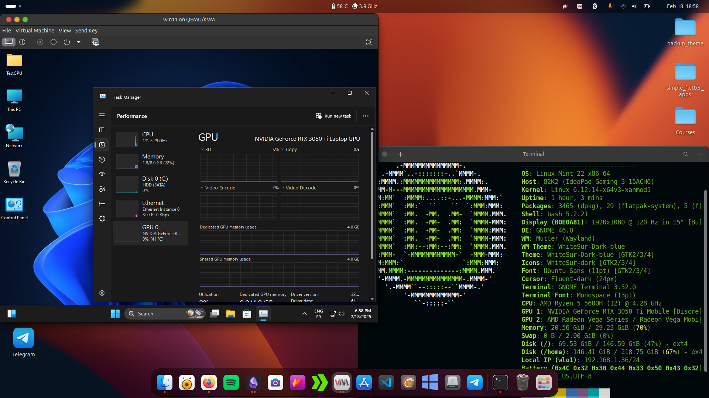
  <br>
  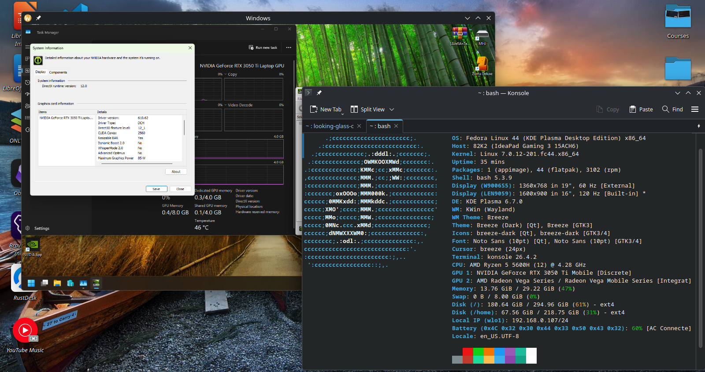
</div>

## 0. Pre-requirements :

- Before starting the journey of laptop gpu passthrough, some requirements must be met :

1. Make sure you have a working host os, preferably Fedora or Mint(or ubuntu-based Distro)

2. Your laptop must have their virtualization options enabled in BIOS :
   | CPU Type | Virtualization Type | IOMMU Type |
   | -------- | ------------------- | -------------------------------------------------- |
   | Intel | VT-x | VT-d |
   | AMD | AMD-V / SVM | AMD-Vi (should be enabled by default if not found) |

3. Your system must have KVM support :

```bash
ls -l /dev/kvm
# It should return something like this:
crw-rw-rw-. 1 root kvm 10, 232 Jun 25 11:50 /dev/kvm
```

4. For now, we won't need the NVIDIA Driver on the Host OS. We will install it in the last steps of the guide.

## 1. GPU Isolation :

### 1.1. Retreiving GPU ID :

- To start, we need to get the GPU ID :

```bash
lspci -nn | grep -E "NVIDIA"
```

- The command should return the following :
  <div>
    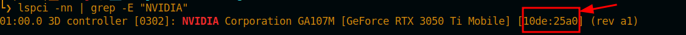
  </div>

- Copy that ID for now

### 1.2. Setting Up Kernel Arguments and IOMMU Grouping :

#### 1.2.1. For Linux Mint :

- Now, we need to modify the default kernel arguments upon boot :

```bash
sudo nano /etc/default/grub
```

- Here, we will append the following in the `GRUB_CMDLINE_LINUX_DEFAULT` :

```bash
# For Intel CPU :
intel_iommu=on iommu=pt vfio-pcis.ids=<nvidia_gpu_id>
# For AMD CPU :
amd_iommu=on iommu=pt vfio-pcis.ids=<nvidia_gpu_id>
```

<div>
  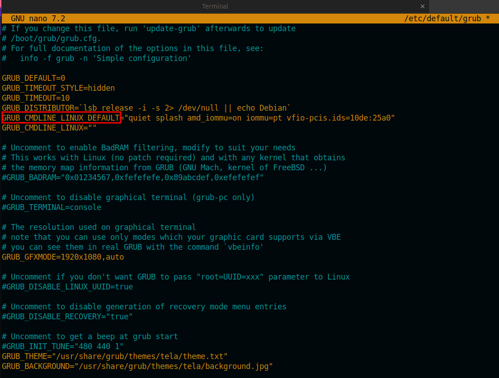
</div>

- After adding the arguments, exit the editor after saving the modifications and then we have to update grub to use our new arguments :

```bash
sudo update-grub
or
sudo grub-mkconfig -o /boot/grub/grub.cfg
```

- Now, reboot your laptop to apply the new configurations.

- After rebooting, we need to check the `iommu` groupings to see if everything is good to go.

- To do this, copy the following code to a new file called `iommu.sh`, make it executable with `chmod +x iommu.sh` and then run it with `./iommu.sh`.

```bash
 #!/bin/bash
shopt -s nullglob
for g in $(find /sys/kernel/iommu_groups/* -maxdepth 0 -type d | sort -V); do
	echo "IOMMU Group ${g##*/}:"
	for d in $g/devices/*; do
		echo -e "\t$(lspci -nns ${d##*/})"
	done;
done;
```

- If you see the following result, then we are good to go to the next step :
<div>
  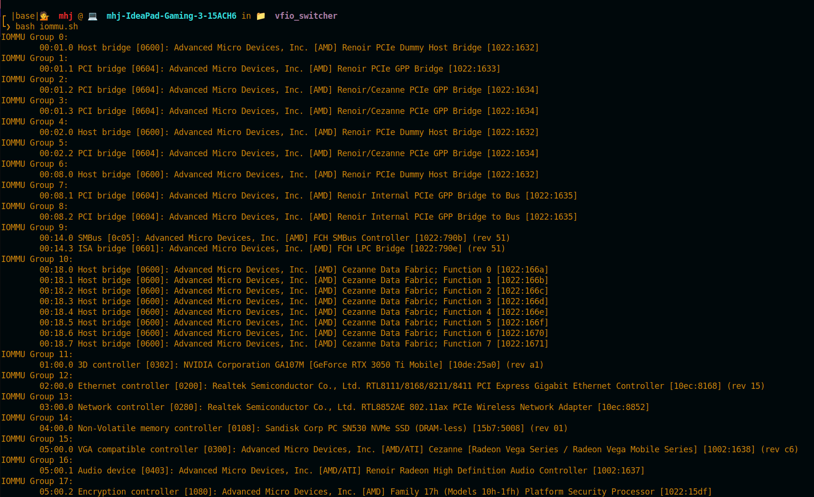
</div>

#### 1.2.2. For Fedora Linux :

- Almost the same steps like Linux Mint setup but with different commands or files to modify or execute.

- To start, We need to modify the Default Kernel Boot Arguments.
- In `/etc/sysconfig/grub` file, we need to append the following arguments to `GRUB_CMDLINE_LINUX` :

```
# For AMD CPUs :
amd_iommu=on iommu=pt rd.driver.pre=vfio-pci vfio-pci.ids=<your_gpu_id> module_blacklist=nouveau,nova_core

# For Intel CPUs :
intel_iommu=on iommu=pt rd.driver.pre=vfio-pci vfio-pci.ids=<your_gpu_id> module_blacklist=nouveau,nova_core
```

<div>
  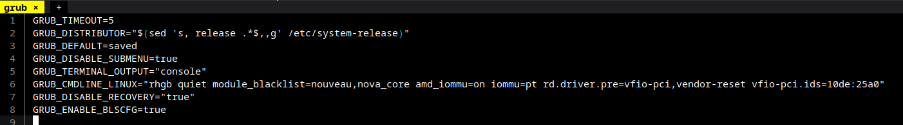
</div>

- Exit saving the changes and then regenerate grub by executing the following command :

```
sudo grub2-mkconfig -o /boot/grub2/grub.cfg
```

- Reboot to apply changes and then check the IOMMU Grouping by doing the same steps as Linux Mint.

### 1.3. Setting up vfio-pci for GPU Isolation :

#### 1.3.1. For Linux Mint :

- For this part, we need to create the VFIO configuration files that will help us isolate our GPU from the Host OS.

- First, we need to create `vfio.conf` configuration file in `/etc/modprobe.d/` and add the following line :

```
options vfio-pci ids=<GPU_id>
```

<div>
  
</div>

- Second, we need to append the following lines to `/etc/initramfs-tools/modules` :

```
vfio
vfio_iommu_type1
vfio_pci
vfio_virqfd
```

- Third, exit saving the new modifications and then rebuild the initramfs by executing :

```bash
sudo update-initramfs -c -k $(uname -r)
```

- Last, reboot your laptop to apply the new modifications and then check if the GPU Isolation is working by executing this command :

```bash
lspci -k | grep -E "vfio-pci|NVIDIA"
```

<div>
  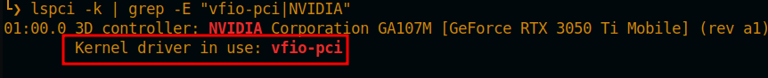
</div>

#### 1.3.2. For Fedora Linux :

- The same logic as Linux Mint applies to Fedora Linux but with different files or commands

- First, we need to create `local.conf` file inside `/etc/dracut.conf/` and add the following line :

```
add_drivers+=" vfio vfio_iommu_type1 vfio_pci "
```

- Second, Regenerate the initramfs :

```bash
sudo dracut -f --kver `uname -r`
```

- Finally, reboot your laptop to apply the new configurations and check if the GPU isolation is working as intended by executing :

```bash
lspci -k | grep -E "vfio-pci|NVIDIA"
```

<div>
  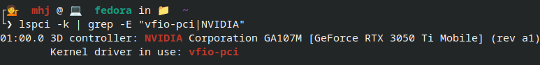
</div>

## 2. Passing-through the Isolated GPU :

### 2.1. Adding the GPU to the VM Hardware :

- Now that we have successfully isolated the GPU from the Host OS by binding it to `vfio-pci` driver, we can go to the next step which is adding the GPU to our windows 11 VM.

- Let's open the Virtual Machine Manager and show the details about our Windows VM
  <div>
    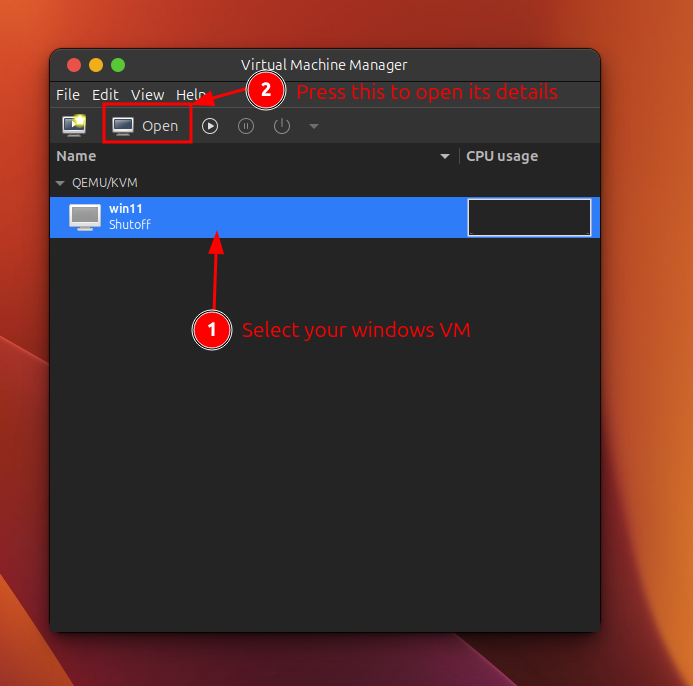
    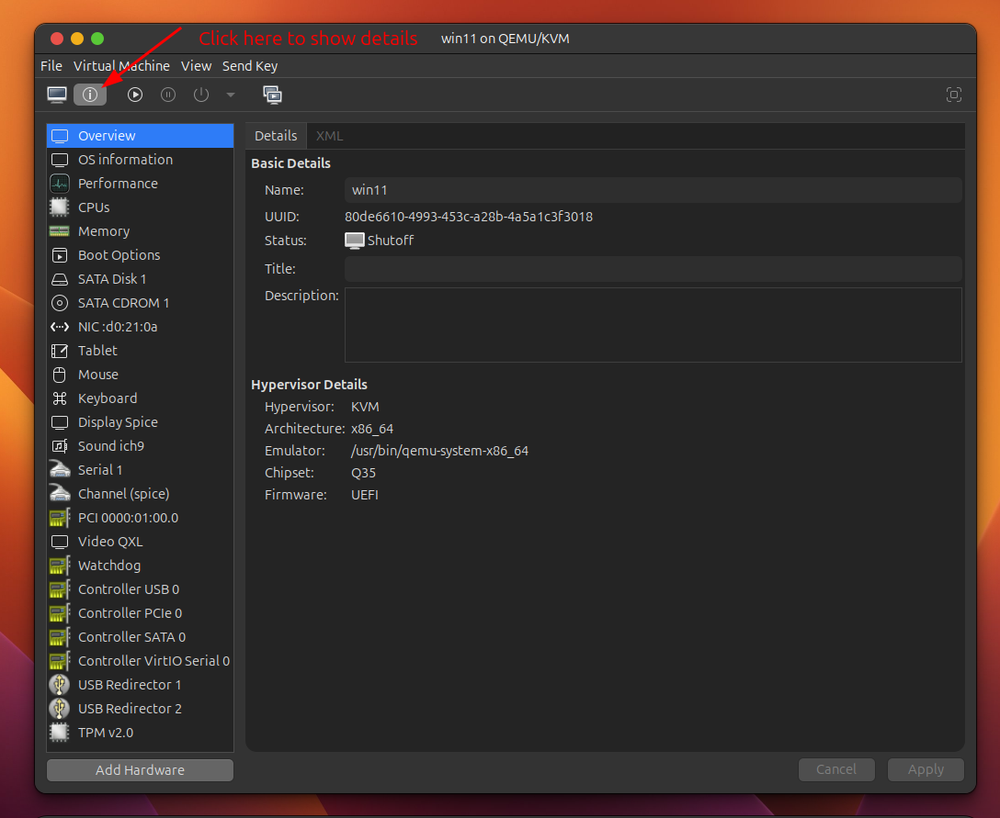
  </div>

- Now, we need to add the gpu :
  1. Click on `Add Hardware`
  2. Select `PCI Host Device`
  3. Look for your isolated GPU (By its name)
  4. Click on `Finish` to add the GPU
  <div>
    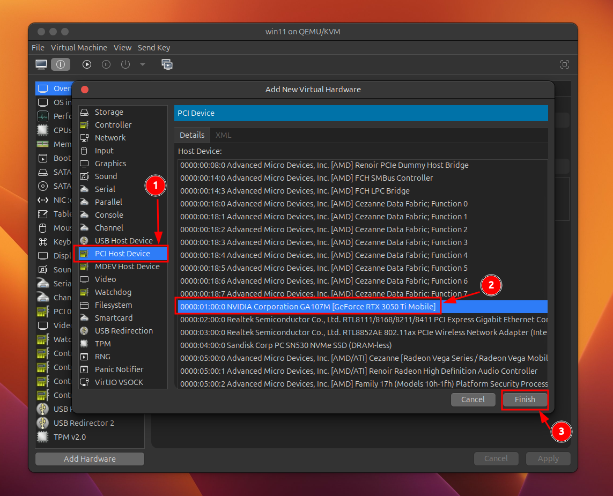
  </div>

- The result should look like the following :
  <div>
    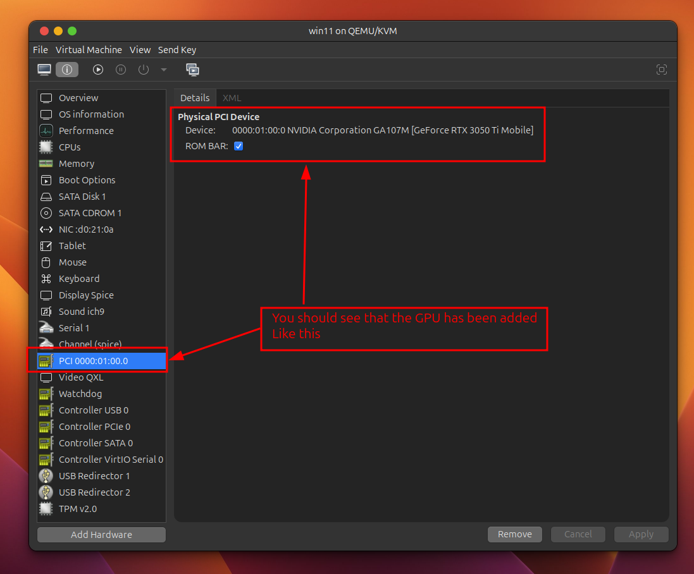
  </div>

### 2.2. Booting The VM and Installing the Driver :

- Now that we setup everything we need, you can proceed to boot the Windows VM.
- If you check the Device Manager, you can see a missing `3D Controller` driver.
- That means that everything is working as intended
- All what you have to do now is download and install its driver, in our case NVIDIA.
- After it gets installed, it should appears in the Device Manager and the Task Manager in the `Performance` Tab
  <div>
    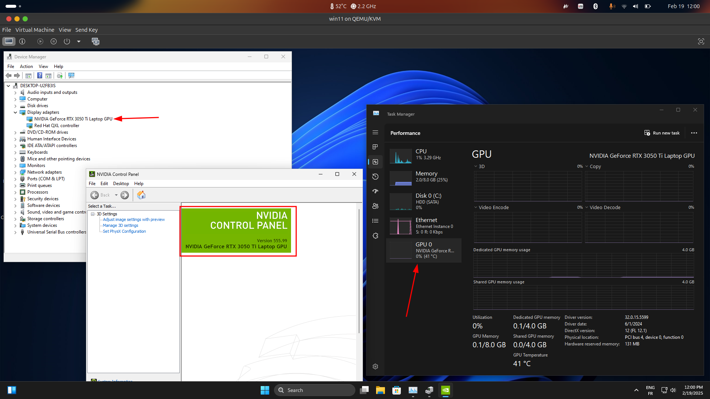
  </div>

## 3. Using the Isolated GPU as the main GPU with Looking Glass :

- Although everything is working, there is something that we need to fix which is the latency of SPICE display.
- The default display driver, which is QXL in most case, lacks the smoothness and the low-input latency that may lead to some bad experience using the VM like Gaming, intense workload or general usability.
- To fix this issue, we need to setup `Looking Glass`

- **Looking Glass** is an open source application that allows the use of a KVM (Kernel-based Virtual Machine) configured for VGA PCI Pass-through without an attached physical monitor, keyboard or mouse. This is the final step required to move away from dual booting with other operating systems for legacy programs that require high performance graphics.

- It is a great tool to have if you don't have external monitor. Unlike using live capture/remote display client such as NVIDIA Stream, Moonlight or FreeRDP; Looking Glass have insanely **low latency** and **no compression/artifacts** because the video memory is shared from Linux to VM directly.

### 3.1. Setting Up a dummy HDMI plug :

- Before we start setting up Looking Glass, we need to configure a virtual Dummy HDMI Plug to make windows think that it has a plugged in HDMI to ensure that the dedicated GPU has a display connected otherwise Windows won't render anything.

> Remember, we are using a muxless laptop so using a physical hdmi dummy plug
> won't work because the hdmi port on the laptop is wired to the iGPU not
> the dGPU.

1. Start your VM
2. Download [IddSimpleDriver](https://github.com/ge9/IddSampleDriver/releases/tag/0.0.1.2) and extract it to your root Drive, which is in general `C:\`
3. In the `IddSimpleDriver` folder, add/edit the resolutions in `option.txt` to match your screen resolution and refresh rate
<div>
  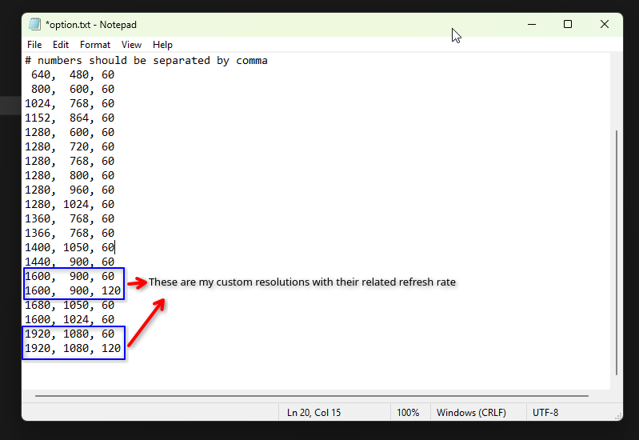
</div>

4. Open `Powershell` or `cmd` in `Admin Mode` and execute the following commands :

```cmd
cd C:\IddSampleDriver
.\certmgr.exe /add IddSampleDriver.cer /s /r localMachine root
```

5. Head to `Device Manager` and then click on the Desktop Name (e.g. DESKTOP-SQKKV12).

6. At the top panel, select `Action > Add legacy Hardware`
<div>
  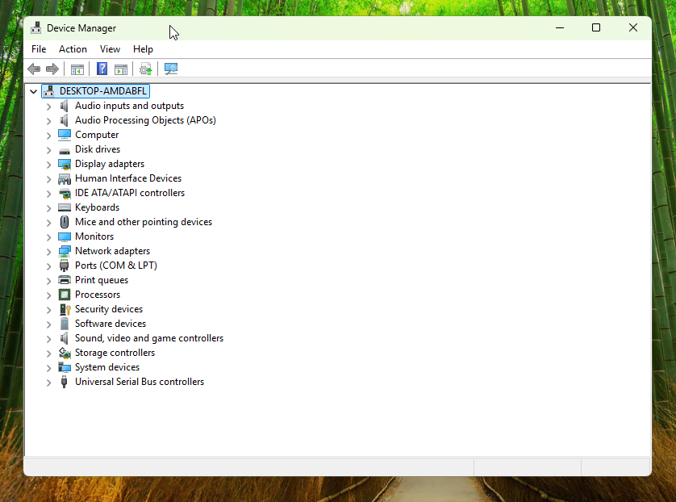
  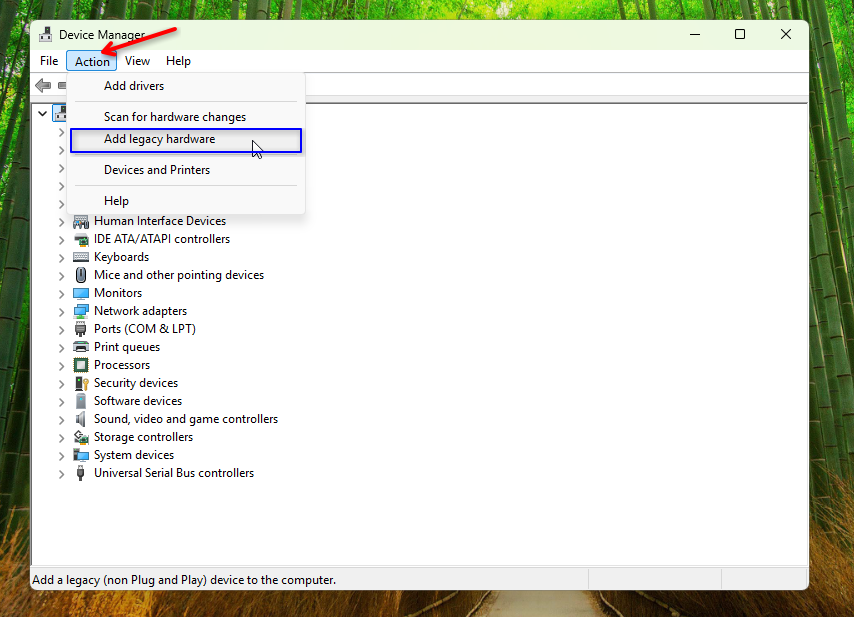
</div>

7. Click `Next > Install hardware that I manually select from a list (Advanced)`
<div>
  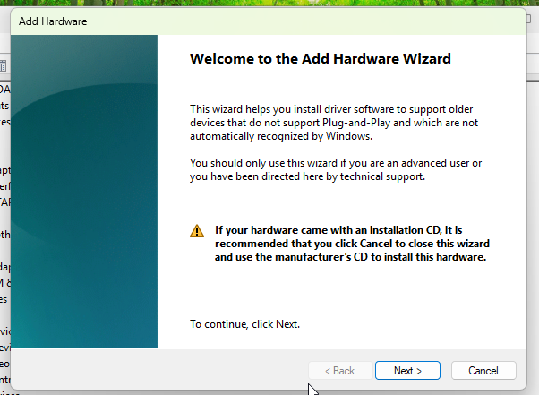
  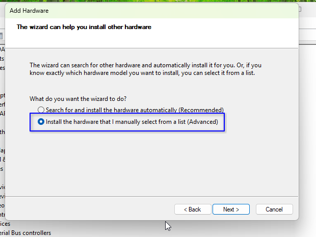
</div>

8. Click `Next > Select Show All Devices > Next`
<div>
  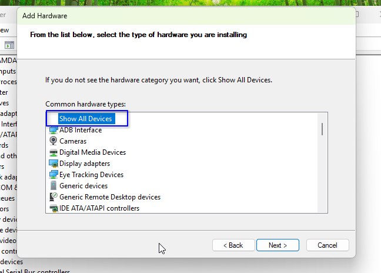
</div>

9. Click `Select Hard disk > Browse`
<div>
  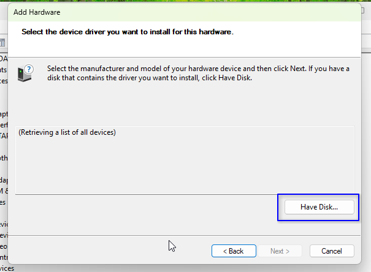
  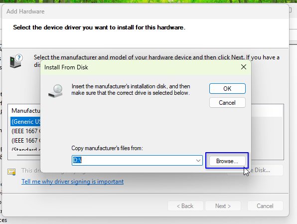
</div>

10. Find `C:\IddSampleDriver\IddSampleDriver.inf` and Select `Open`
<div>
  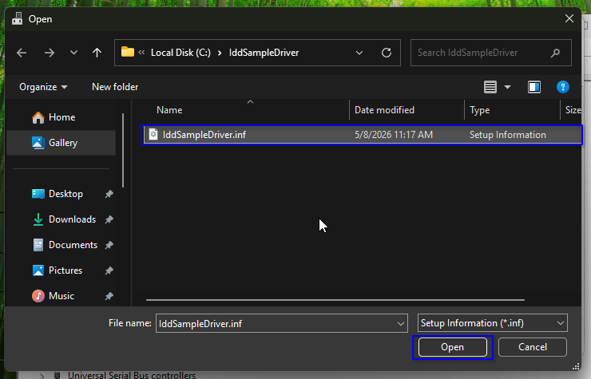
</div>

11. Click `OK > Next`, wait for it to install and then click `Next` again to exit the setup.
<div>
  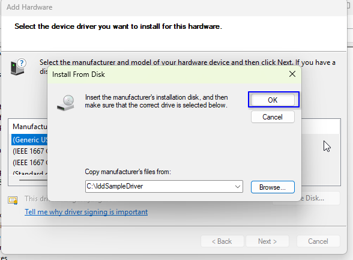
  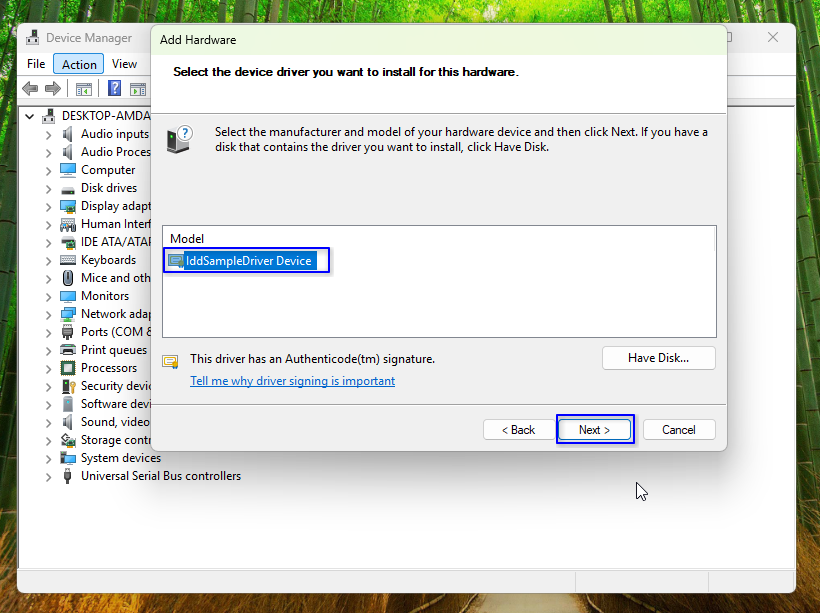
</div>

### 3.2. Setting up Looking Glass on Host OS :

- Now, we are going to compile Looking Glass client on the Host OS from source

1. We need to install the required dependancies :

```bash
# For Linux Mint :
sudo apt-get install binutils-dev cmake fonts-dejavu-core libfontconfig-dev \
gcc g++ pkg-config libegl-dev libgl-dev libgles-dev libspice-protocol-dev \
nettle-dev libx11-dev libxcursor-dev libxi-dev libxinerama-dev \
libxpresent-dev libxss-dev libxkbcommon-dev libwayland-dev wayland-protocols \
libpipewire-0.3-dev libpulse-dev libsamplerate0-dev
```

```bash
# For Fedora Linux :
sudo dnf install -y cmake gcc gcc-c++ libglvnd-devel fontconfig-devel spice-protocol make nettle-devel \
            pkgconf-pkg-config binutils-devel libXi-devel libXinerama-devel libXcursor-devel \
            libXpresent-devel libxkbcommon-x11-devel wayland-devel wayland-protocols-devel \
            libXScrnSaver-devel libXrandr-devel dejavu-sans-mono-fonts

sudo dnf install -y pipewire-devel libsamplerate-devel
sudo dnf install -y pulseaudio-libs-devel libsamplerate-devel
```

2. Download the looking glass source code from [their website](https://looking-glass.io/downloads), which can be found under `Official/Stable` version and choosing `source` (Currently, the latest stable version of Looking Glass is B7)

3. Extract the source code in any directory you want. In my case, I will stick with $HOME Path:

```bash
tar -xvf /path/to/looking-glass-B7.tar.gz -C ~/
```

4. Now, we are going to build the client :

```bash
cd ~/looking-glass-B7/client
mkdir build && cd build

# If you are non-GNOME wayland user, exeucte this :
cmake ../

# If you are GNOME Wayland user :
# 1. Install these dependancies first :
# For Linux Mint :
sudo apt install libdecor-0-dev
# For Fedora Linux :
sudo dnf install libdecor-devel

# 2. You can compile with these command :
cmake -DENABLE_LIBDECOR=ON ../

# After setting up cmake, you can build the client with :
make
# or
sudo make install # To install globally
```

5. After the Looking Glass client is built, we can verify if it's working :

```bash
./looking-glass-client --help # if you're still in the build directory
# or
looking-glass-client --help # if installed globally
```

<div>
  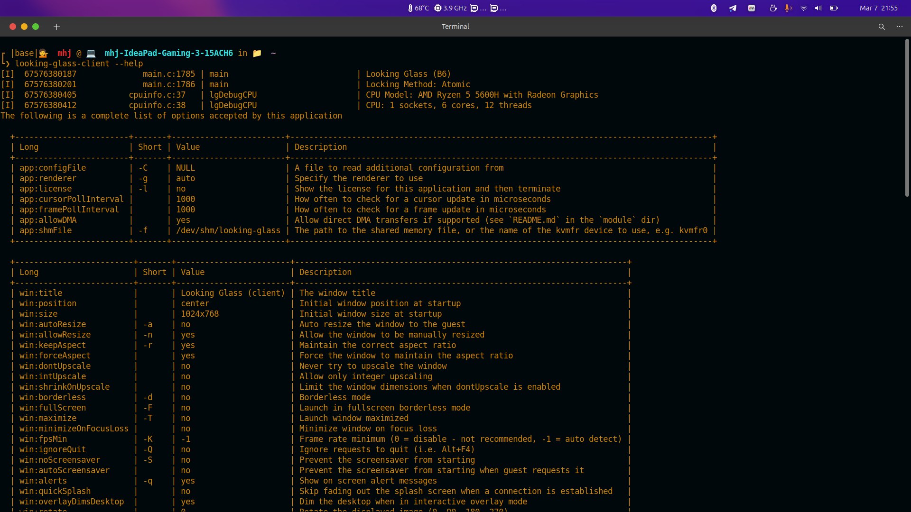
</div>

> We will assume that looking glass is installed globally for simplicity sake

### 3.3. Setting up Looking Glass Permissions :

#### 3.3.1. For Linux Mint :

- All we have to do is executing the following commands and we are good to go:

```bash
sudo touch /dev/shm/looking-glass
sudo chown $USER:kvm /dev/shm/looking-glass
sudo chmod 660 /dev/shm/looking-glass
```

#### 3.3.2. For Fedora Linux :

- Due to SELinux, we need extra steps in Fedora

1. Create the file `10-looking-glass.conf` in `/etc/tmpfiles.d` and add the following :

```
# Type Path               Mode UID  GID Age Argument
f /dev/shm/looking-glass 0660 <your_user_name> qemu -
```

2. Execute the following command to set SELinux context :

```bash
sudo semanage fcontext -a -t svirt_tmpfs_t /dev/shm/looking-glass
```

3. Reboot your Laptop to apply the new changes

### 3.4. Edit VM Configuration :

1. Head to `Virtual Machine Manager` and open the Windows VM details
2. In the `Memory` Tab, enable the `Enabled shared memory` option
3. In your `XML` configuration Tab, scroll down to the botton and add the following between `<memballon/>` and `</devices>` and save the changes:

```
<shmem name='looking-glass'>
  <model type='ivshmem-plain'/>
  <size unit='M'>32</size>
</shmem>
```

> For 1080p display, 32M is plenty enough
> If you want to have 2K+ resolutions, see [this guide](https://looking-glass.io/docs/B5.0.1/install/#determining-memory) to determine
> the memory size

### 3.5. Setting up Looking Glass on VM :

1. Boot your Windows VM if you shut it down
2. Now, go to the Looking Glass website and download the **Windows Host Binary** from [here](https://looking-glass.io/downloads). Make sure the version is the same as your client.
3. Extract this zip file that you have downloaded and install Looking Glass.
4. Shut down your VM.
5. Then, navigate to `Display Spice` tab and edit those fields like this:
<div>
  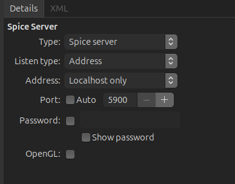
</div>

6. Here, we need to passthrougth the mouse to the VM so that we can setup the VM main screen and resolution. Follow the same steps as passing the GPU but instead of the `PCI Host Device`, it's `USB Host Device` and then select your mouse.

7. Now, Boot your Your VM again and wait until it's open. You will notice that you can't access to do anything.
   That's because it's not the main screen. The IddSampleDriver is the main screen that we will interact with.

8. Now, Open the terminal and execute `looking-glass-client -s` to open Looking Glass to be able to access the main screen.
   - A small window should open and you can see your desktop from it :
      <div>
        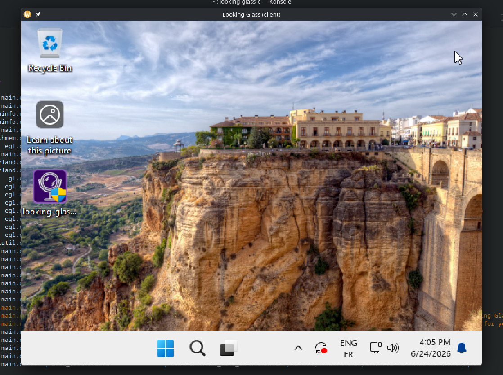
      </div>

9. With your mouse, `Right-click` on dekstop and select `Display Settings`
10. Now, Mark the first screen as main

      <div>
        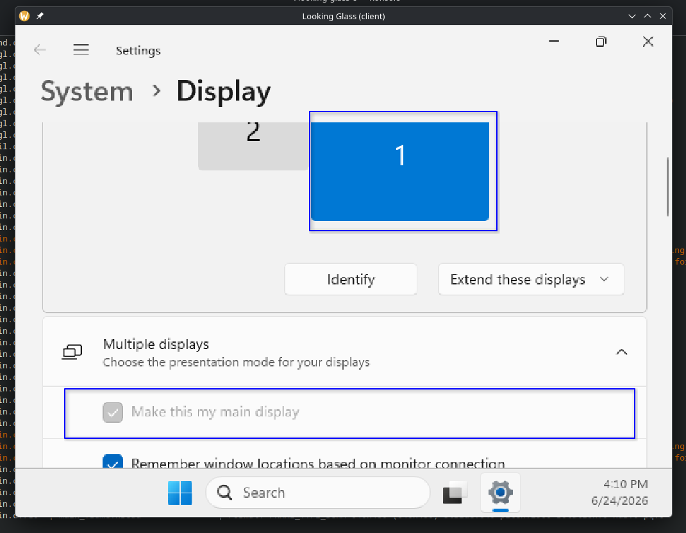
      </div>

11. Shutdown the VM. Then go to the VM settings, under `Video` tab, change the model type to `None` and save the changes.
12. Before booting the VM again, we need to setup a configuration file for the Looking Glass client so it won't appear chopping.
    For this, we need to create `main.ini` in `~/.config/looking-glass` path with the following configuration :

```
[app]
shmFile=/dev/shm/looking-glass

[win]
title=Windows
size=1920x1080
autoResize=yes
fullScreen=yes
uiFont=pango:Iosevka

[input]
escapeKey=97
rawMouse=no
captureOnFocus=yes
mouseSens=-1
```

> - change the size to match your screen
> - escapeKey is `RIGHT-CTRL`

- With this configuration, Looking Glass with open in fullscreen mode so it will act like it's actually like native screen

13. Boot your VM again, wait for it to boot (~20-30s). then execute this command to open Looking Glass with its new configurations

```bash
looking-glass-client -C ~/.config/looking-glass/main.ini
# You can set an alias to the command
```

14. Now, you can set the windows screen resolution to match your screen resolution and refresh rate
      <div>
        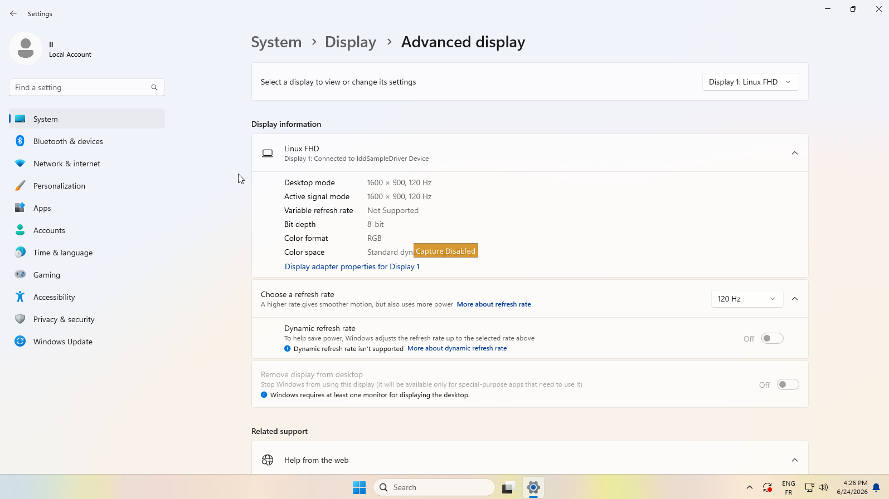
      </div>

15. Congrats. You have now successfully prepared a Windows QEMU/KVM VM with dGPU Passthrough.

> - To toggle capture mode, press `RIGHT-CTRL`
> - To exit Looking Glass, Press `RIGHT+CTRL + Q`
> - Long pressing `RIGHT-CTRL` will show a little menu containing how to interact with looking glass

### 3.6. GPU Hot-Switching :

- In your Host OS, you may need your GPU to perform some tasks
- All we have to do is unload the `vfio-pci` driver and load back your GPU driver and you're good to go

> - For NVIDIA, switching between `vfio-pci` and `nvidia` driver is smooth and simple.
> - For AMD, you may need a full reboot because your GPU may suffer the infamous `vendor-reset` bug
>   `vendor-reset` bug is when your GPU can't reset itself to a clean state to be initialized and be used again
> - Not all AMD card got it but there is a high chance that you got it

- Before starting, We must install the `nvidia` driver on the Host OS :

- For Linux Mint :

```bash
sudo apt install update
sudo apt install software-properties-common -y
sudo add-apt-repository ppa:graphics-drivers/ppa -y
sudo apt update
sudo apt install nvidia-driver-<driver_version> -y
```

- For Fedora Linux :

```bash
sudo dnf update -y
sudo dnf install -y kernel-devel kernel-headers gcc make dkms acpid \
                    libglvnd-glx libglvnd-opengl libglvnd-devel pkgconfig

sudo dnf install -y \
                        https://download1.rpmfusion.org/free/fedora/rpmfusion-free-release-$(rpm -E %fedora).noarch.rpm \
                        https://download1.rpmfusion.org/nonfree/fedora/rpmfusion-nonfree-release-$(rpm -E %fedora).noarch.rpm

sudo dnf install -y akmod-nvidia xorg-x11-drv-nvidia-cuda
```

> If you don't want to bother copying and pasting all these commands, I have a script that automates the installation
> of the NVIDIA Driver.
>
> ```bash
> sudo apt install git -y # For Linux Mint
> sudo dnf install git -y # For Fedora Linux
> git clone https://github.com/MHJedli/utility_script.git
> cd utility_script/
> bash utility_script --install nvidia_driver
> ```

- Reboot your laptop

- Now, execute `lspci -nn | grep -E "NVIDIA"` to get the GPU pci number because we need to in the dynamic binding
<div>
  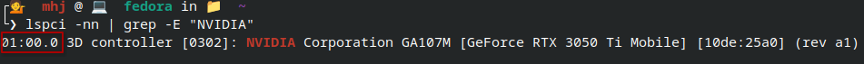
</div>

- From that number, we will write it this way : `pci_0000_01_00_0`

- Now, we can start with GPU `reattach` and `detach` switching

1. To reattach the GPU to the `nvidia` driver (meaning that we are going to remove the GPU Isolation to make it visible to the Host OS) :

```bash
sudo virsh nodedev-reattach pci_0000_01_00_0
sudo rmmod vfio_pci vfio_pci_core vfio_iommu_type1
sudo modprobe -i nvidia_modeset nvidia_uvm nvidia
```

- We can verify if the GPU is using the `nvidia` driver with `nvidia-smi`
- If `nvidia-smi` returned a result, then we are good
  <div>
    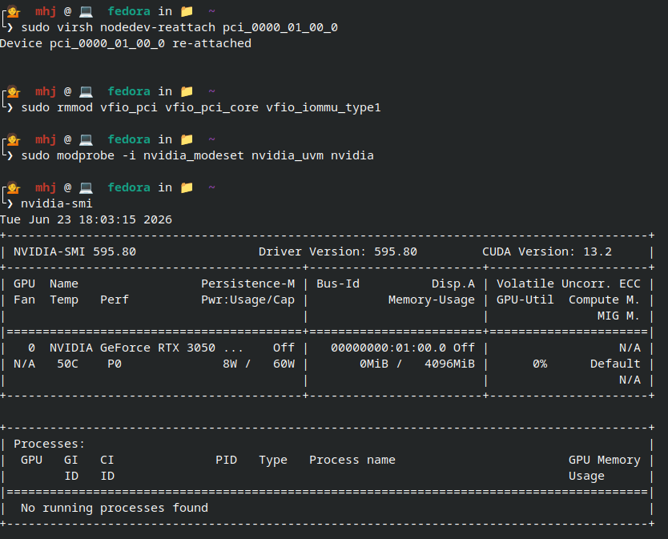
  </div>

2. To detach the GPU from the Host OS to isolate it again with the `vfio-pci` driver :

```bash
sudo rmmod nvidia_modeset nvidia_uvm nvidia
sudo modprobe -i vfio_pci vfio_pci_core vfio_iommu_type1
sudo virsh nodedev-detach pci_0000_01_00_0
```

- If the command `nvidia-smi` returned an error then we are good
- you can even verify if the GPU is actually using the `vfio-pci` driver, just in case, by executing `lspci -k | grep -E "vfio-pci|NVIDIA"`
  <div>
    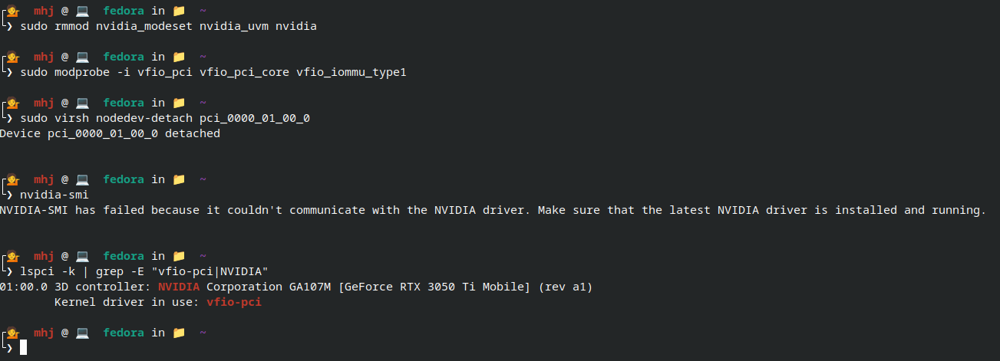
  </div>

3. you can create aliases to avoid copy-pasting the commands all the time by appending the following in your .\*rc file. Reopen your terminal after saving:

```bash
alias nvidia-status='echo "NVIDIA Dedicated Graphics" | grep "NVIDIA" && lspci -nnk | grep "NVIDIA Corporation" -A 2 | grep "Kernel driver in use" && echo "Enable and disable the dedicated NVIDIA GPU with nvidia-enable and nvidia-disable"'

alias nvidia-enable='sudo virsh nodedev-reattach pci_0000_01_00_0 && echo "GPU reattached (now host ready)" && sudo rmmod vfio_pci vfio_pci_core vfio_iommu_type1 && echo "VFIO drivers removed" && sudo modprobe -i nvidia_modeset nvidia_uvm nvidia && echo "NVIDIA drivers added" && echo "COMPLETED!"'

alias nvidia-disable='sudo rmmod nvidia_modeset nvidia_uvm nvidia && echo "NVIDIA drivers removed";  sudo modprobe -i vfio_pci vfio_pci_core vfio_iommu_type1 && echo "VFIO drivers added" ; sudo virsh nodedev-detach pci_0000_01_00_0 && echo "GPU detached (now vfio ready)" && echo "COMPLETED!"'
```

> nvidia-status will help detect in what mode your GPU is activated
> By default, the GPU will be binded to vfio-pci

## 4. Tweaks :

### 4.1. Fix keyboard acting weird:

- When using Windows with Looking Glass on laptop, the Laptop keyboard won't behave the usual way like :
  - The keyboard won't let you press keys continuously (deleting a word, holding a word, moving with arrows,.. )
  - The windows button won't work unless pressing CTRL+Esc together, which is annoying

- An easy fix for this issue is to edit the XML configuration of the `Keyboard` bus to virtio in VM `Hardware List` :

```XML
<input type="keyboard" bus="virtio">
```

> A second keyboard may appear in the Hardware list, So ignore it

### 4.2. Fix NVIDIA Code 43 for Mobile GPU :

- This error occurs because the Nvidia driver wants to check the status of the power supply. If no battery is present, the driver does not work. Whether Libvirt or QEMU, by default none of them provide the possibility to simulate a battery.

- You can however create and add a custom acpi table file to the virtual machine which will do the work.

> This Fix should work but not always guarantied

1. Create the custom ACPI table file by executing the following command :

```bash
echo 'U1NEVKEAAAAB9EJPQ0hTAEJYUENTU0RUAQAAAElOVEwYEBkgoA8AFVwuX1NCX1BDSTAGABBMBi5f
U0JfUENJMFuCTwVCQVQwCF9ISUQMQdAMCghfVUlEABQJX1NUQQCkCh8UK19CSUYApBIjDQELcBcL
cBcBC9A5C1gCCywBCjwKPA0ADQANTElPTgANABQSX0JTVACkEgoEAAALcBcL0Dk=' | base64 -d > SSDT1.dat
```

2. You must add the processed file to the main XML domain of the Virtual Machine :

```XML
<domain xmlns:qemu="http://libvirt.org/schemas/domain/qemu/1.0" type="kvm">
  ...
  <qemu:commandline>
    <qemu:arg value="-acpitable"/>
    <qemu:arg value="file=/path/to/your/SSDT1.dat"/>
  </qemu:commandline>
</domain>
```

> The first line of the XML domain must have the `xmlns:qemu="http://libvirt.org/schemas/domain/qemu/1.0"`
> attribute so that the `<qemu:commandline>` tag stays and won't be deleted

3. Try rebooting the VM

4. In case QEMU throws a permission error related to the `SSDT1.dat` file, additional configurations must be set

4.1. For Linux Mint :

- The permission error is because of apparmor.
- To avoid this error :

1. Get the VM UUID (from overview in Virtual Machine Manager)
2. change directory to `/etc/apparmor.d/libvirt/`
3. locate the file `libvirt-{you_vm_uuid}`
4. Inside that file, add `/path/to/SSDT1.dat rk,` in the profile section
5. exit saving changes and reload apparmor with `sudo systemctl restart apparmor.service`
6. Your VM should be working properly now and the fake battery should appear in your VM

4.2. For Fedora Linux :

- The permission error is due to SELinux
- To avoid this error :

```bash
sudo mkdir -p /var/lib/libvirt/vgabios
sudo cp /path/to/SSDT1.dat /var/lib/libvirt/vgabios
sudo chmod -R 644 /var/lib/libvirt/vgabios/SSDT1.dat
sudo chown $USER:$USER /var/lib/libvirt/vgabios/SSDT1.dat
sudo semanage fcontext -a -t virt_image_t /var/lib/libvirt/vgabios/SSDT1.dat
sudo restorecon -v /var/lib/libvirt/vgabios/SSDT1.dat
```

- Go back to the VM main XML domain and edit the path of the `SSDT1.dat` to `/var/lib/libvirt/vgabios/SSDT1.dat`

- Save the changes and the VM should start working properly
